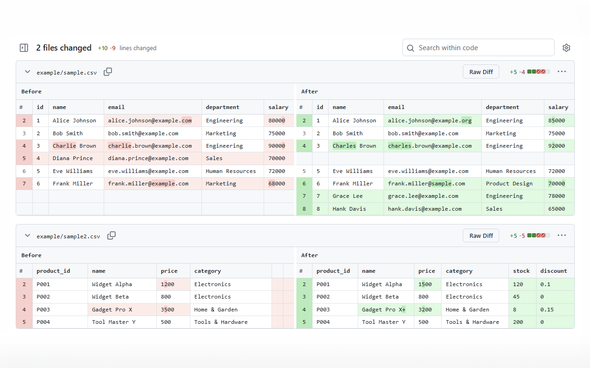
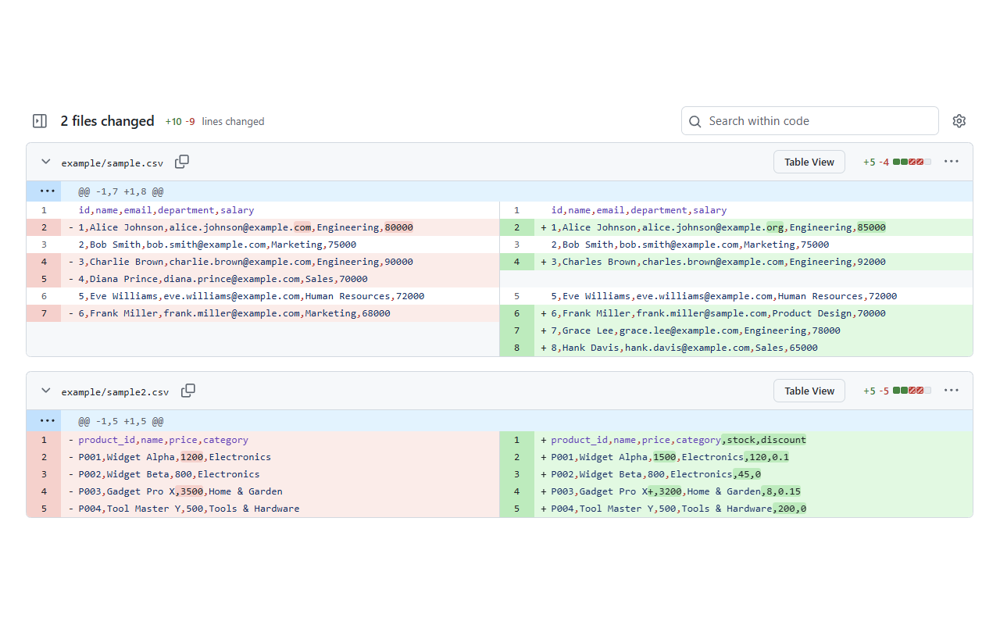

# GitHub Better CSV Diff

A browser extension that renders CSV file diffs as readable side-by-side tables on GitHub.

GitHub's default diff view shows CSV changes as raw text, making it hard to see what actually changed. This extension parses the diff and displays it as a structured table with inline highlighting, so you can instantly spot additions, removals, and modifications.

## Features

- Side-by-side (Before / After) table view for CSV diffs
- Inline word and character-level change highlighting
- Works on Pull Request pages and commit diff pages
- Supports both GitHub's Preview UI and Classic UI layouts
- Toggle between the original diff and the table view
- No authentication required — works entirely from the page DOM
- Minimal permissions: only runs on `github.com`

## Screenshots





## Install

> [](https://chromewebstore.google.com/detail/jmfogejgalnkpocgepneniogiajbiinc)
>
> [](https://chromewebstore.google.com/detail/jmfogejgalnkpocgepneniogiajbiinc)

> [](https://addons.mozilla.org/firefox/addon/github-better-csv-diff/)
>
> [](https://addons.mozilla.org/firefox/addon/github-better-csv-diff/)

## Development

### Prerequisites

- [Node.js](https://nodejs.org/) (v18+)
- npm

### Setup

```bash
git clone https://github.com/letconst/github-better-csv-diff.git
cd github-better-csv-diff
npm install
```

### Dev server

```bash
npm run dev            # Chrome (with HMR)
npm run dev:firefox    # Firefox
```

Load the unpacked extension:
- **Chrome**: Go to `chrome://extensions`, enable Developer mode, and load `dist/chrome-mv3/`
- **Firefox**: Go to `about:debugging`, and load `dist/firefox-mv2/`

### Production build

```bash
npm run build          # Chrome
npm run build:firefox  # Firefox
```

## License

[MIT](LICENSE)
